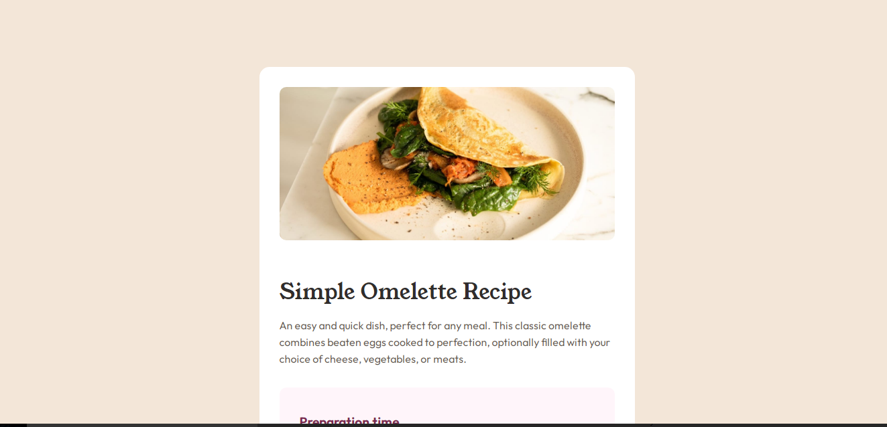

# Frontend Mentor - Recipe page solution

This is a solution to the [Recipe page challenge on Frontend Mentor](https://www.frontendmentor.io/challenges/recipe-page-KiTsR8QQKm). Frontend Mentor challenges help you improve your coding skills by building realistic projects. 

## Table of contents

- [Overview](#overview)
  - [Screenshot](#screenshot)
  - [Links](#links)
- [My process](#my-process)
  - [Built with](#built-with)
  - [What I learned](#what-i-learned)
  - [Continued development](#continued-development)
  - [Useful resources](#useful-resources)
- [Author](#author)
- [Acknowledgments](#acknowledgments)

## Overview
### Screenshot


### Links

- Solution URL: [FEM Recipe Page](https://github.com/chinois213/fem-recipe-page)
- Live Site URL: [FEM Recipe live preview](https://chinois213.github.io/fem-recipe-page/)

## My process

### Built with

- Semantic HTML5 markup
-CSS for styling
- CSS custom properties
- Mobile-first workflow


### What I learned

I Learned how to use the CSS custom properties which makes it possible for me to easily reuse certain properties of my design.In the code snippet, i created custom properties for different colors of the design, and also created some custom properties for font-size im my design

```css
:root{
  
    --fs-base:16px;
    --fs-1:32px;
    --fs-2:28px;
    --fs-3:19px;
    --white: hsl(0, 0%, 100%);
    --stone100:hsl(30, 54%, 90%);
    --stone150: hsl(30, 18%, 87%);
    --stone600: hsl(30, 10%, 34%);
    --stone900: hsl(24, 5%, 18%);
    --brown800:hsl(14, 45%, 36%);
    --rose800:hsl(332, 51%, 32%);
    --rose50:hsl(330, 100%, 98%);

    --sm:375px;
    --lg:720px;
    --xl:1440px ;

}
```
I also learned how to use HTML semantic tacks in my HTML structure , as seen below with the main and section tags

```html
   <main>
     <section></section>
   </main>
```

### Continued development

I need to understand more about the use of media Queries in CSS.

### Useful resources

- [W3Shools](https://www.W3Shools.com) - This website assisted in implementing font import using the @font-face css asset.

## Author

- Frontend Mentor - [@chinois213](https://www.frontendmentor.io/profile/chinois213)
- Contact Me - [+237692573315](https://www.twitter.com/yourusername)


## Acknowledgments

I thanks all my instructors and my self for doing all things possible for me to learn more about FrontendMentor.

